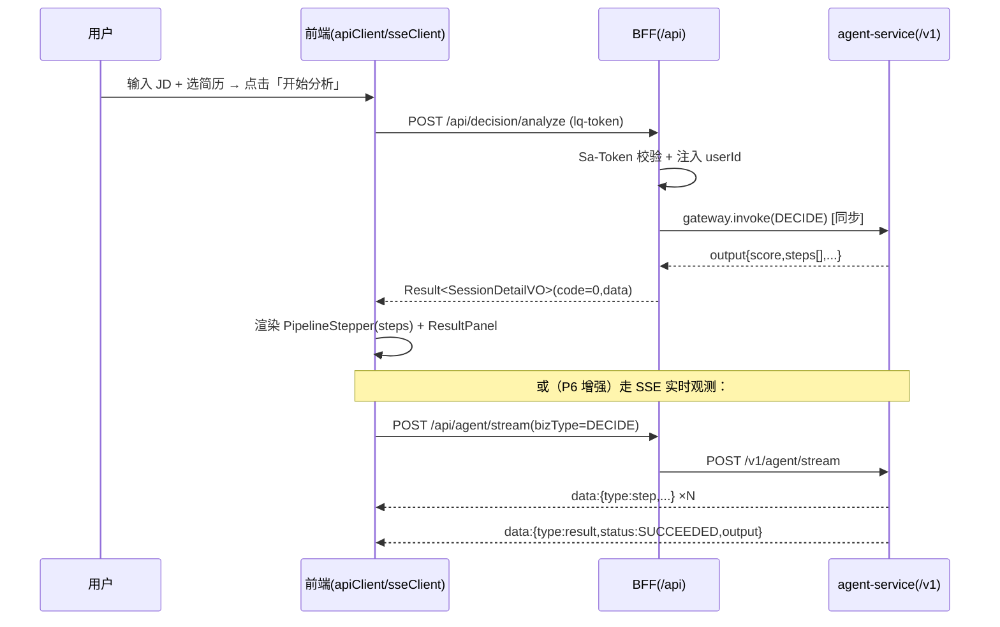

# Chiron Agent 前端架构与设计系统

> 作者：高见远（架构师）
> 隶属：Chiron Agent 企业级求职评估与模拟面试平台
> 技术栈（已定）：React 18 + TypeScript + Vite + Tailwind CSS
> 配套后端：`bff/`（Spring Boot 3.2 / Java 17，端口 8080，context-path `/api`）→ `agent-service/`（FastAPI，端口 8000）
> 本文档唯一权威依据：`docs/00-产品与页面规格.md` 与已读 BFF 源码契约

本文档目标：让执行者（前端工程师）可以**照着直接写代码**，不泛泛而谈。所有接口契约均来自已读源码（`Result/ErrorCode/GlobalExceptionHandler/AuthDtos/ResumeDtos/DecisionDtos/BillingDtos/GatewayDtos/各 Controller/application.yml/WebCorsConfig` 与 `agent-service/app/main.py/schemas.py`），未实现部分明确标注为「待后端落地」。

---

## 1. 信息架构与路由表

一级导航共 7 组（含 系统管理 下 2 项）。`工作台 / 简历中心 / JD 分析 / AI 面试` 作为平级一级入口（与页面规格 §3 将四者作为独立页面一致）；`系统管理` 为可折叠分组。登录页 `/login` 在应用外壳（AppShell）之外。

| 一级导航 | 路由（React Router） | 页面组件（src/features/...） | 说明 |
| --- | --- | --- | --- |
| 工作台（求职能力） | `/` | `workbench/WorkbenchPage.tsx` | 首页：意向输入 + 模型选择 + Mock 开关，自动识别意图路由 |
| 简历中心 | `/resume` | `resume/ResumeCenterPage.tsx` | 三栏：Markdown 编辑 / 简历预览 / 辅助助手 |
| JD 分析 | `/decision` | `decision/DecisionPage.tsx` | 上传/粘贴 JD → 流水线 SSE → 结果面板 + 追问 |
| AI 面试 | `/interview` | `interview/InterviewListPage.tsx` + `interview/InterviewRoomPage.tsx` | 左栏记录列表，右栏面试室（语音/摄像/构思板） |
| Agent 可视化（知识图谱） | `/graph` | `graph/GraphPage.tsx` | 候选人中心三层图谱，红=薄弱 |
| 用户能力追踪（画像/长期记忆） | `/profile` | `profile/ProfilePage.tsx` | 能力标签 + 待确认长期记忆纠偏队列 |
| 系统管理 · 模型管理 | `/admin/models` | `admin/models/AdminModelsPage.tsx` | DeepSeek / OpenAI 兼容接入 + 计费 |
| 系统管理 · 知识库管理 | `/admin/kb` | `admin/kb/AdminKbPage.tsx` | 混合检索（向量+全文）+ 文档预览 |
| 登录 | `/login` | `auth/LoginPage.tsx` | 外壳之外，无侧栏 |

> 账号额度（钱包/流水/充值）作为全局能力，入口放顶栏「额度」按钮，组件复用 `admin/billing/*`，不单独占路由。

---

## 2. `web/` 完整目录结构

> `web/` 当前**不存在**，需从零搭建。以下为完整文件树，每个文件标注职责。按 **feature 组织**（`src/features/<feature>/`），跨功能的公共件放 `src/lib`、`src/store`、`src/app`、`src/shared`。

```
web/
├── index.html                      # Vite 入口 HTML，挂载 #root，预连接字体
├── package.json                    # 依赖与脚本（dev/build/preview/lint/typecheck）
├── vite.config.ts                  # Vite 配置：React 插件 + /api 开发代理到 http://localhost:8080
├── tsconfig.json                   # 应用 TS 配置（strict, paths: @/* -> src/*）
├── tsconfig.node.json              # 仅用于 vite.config 的类型检查
├── tailwind.config.ts              # Tailwind 主题扩展（设计 token 落地，见 §3.5）
├── postcss.config.js               # postcss + autoprefixer
├── .env.development                # VITE_API_BASE=  (留空，走 /api 代理)
├── .env.production                 # VITE_API_BASE=/api  (生产同源)
├── .eslintrc.cjs                   # 代码规范
├── .gitignore                      # node_modules/dist 等
└── src/
    ├── main.tsx                    # 应用入口：挂载 Router + QueryClientProvider + 主题
    ├── App.tsx                     # 顶层：路由表 + 全局 Toast 容器 + 401 兜底
    ├── vite-env.d.ts               # import.meta.env 类型声明
    ├── router/
    │   ├── index.tsx               # createBrowserRouter 路由表（含懒加载）
    │   └── guards.tsx              # 鉴权守卫：未登录跳 /login；admin 路由校验角色
    ├── app/
    │   ├── AppShell.tsx            # 应用外壳：左导航 + 顶栏 + 内容区（Outlet）
    │   ├── SideNav.tsx             # 左侧一级导航（§1 表格），可折叠
    │   ├── TopBar.tsx              # 顶栏：面包屑 + 模型指示 + 额度按钮 + 用户菜单
    │   └── theme.css               # :root CSS 变量清单（§3.3）
    ├── lib/
    │   ├── apiClient.ts            # fetch 封装：注入 lq-token、解包 Result<T>、错误码→提示、401 跳登录
    │   ├── sseClient.ts            # SSE 消费：fetch+ReadableStream，断线重连，step/result 事件
    │   ├── queryClient.ts          # TanStack Query 客户端配置（retry/缓存/staleTime）
    │   ├── tokenStore.ts           # token 持久化（localStorage）+ 读取/清除
    │   ├── errorMessages.ts        # ErrorCode 数值 → 用户可读中文提示映射表
    │   └── format.ts               # 金额/日期/百分比/字节格式化工具
    ├── store/
    │   ├── authStore.ts            # Zustand：当前用户、登录态、token（登录后写入 tokenStore）
    │   └── uiStore.ts             # Zustand：侧栏折叠态、当前选中简历 assetId、Toast 队列、模型选择器状态
    ├── types/
    │   ├── common.ts               # Result<T>、Page<T>、枚举（BizType/ParseStatus/RunStatus 等）
    │   └── index.ts                # 统一再导出
    ├── features/
    │   ├── auth/
    │   │   ├── LoginPage.tsx       # 登录/注册页（外壳之外）
    │   │   ├── api.ts              # /auth/* 请求函数
    │   │   ├── useAuth.ts          # 登录/登出/me 的 hooks
    │   │   └── types.ts            # RegisterRequest/LoginRequest/LoginResponse/UserVO
    │   ├── workbench/
    │   │   ├── WorkbenchPage.tsx   # 首页
    │   │   ├── IntentInput.tsx     # 大输入框（占位「发岗位链接、贴 JD、贴简历...」）
    │   │   ├── ModelPicker.tsx     # 模型下拉（默认 deepseek-chat，数据来自 /models/available）
    │   │   ├── MockToggle.tsx      # Mock 流水线开关
    │   │   ├── api.ts              # /workspace/intent 意图识别
    │   │   └── types.ts            # IntentResult
    │   ├── resume/
    │   │   ├── ResumeCenterPage.tsx# 三栏容器
    │   │   ├── MarkdownEditor.tsx  # 左栏：Markdown 编辑（受控 textarea + 实时预览切换）
    │   │   ├── ResumePreview.tsx   # 中栏：A4 排版预览（缩放 76% / 间距 14mm / 页码）
    │   │   ├── ResumeAssistant.tsx # 右栏：选中文本润色/定制生成 + 应用/回退
    │   │   ├── api.ts              # /resume/* 请求
    │   │   └── types.ts            # ResumeVO/AssetBrief/PolishRequest/PolishVO
    │   ├── decision/
    │   │   ├── DecisionPage.tsx    # JD 分析主页面
    │   │   ├── JdUploader.tsx      # JD 上传/粘贴
    │   │   ├── PipelineStepper.tsx # 流水线步骤条（parse_jd→load_profile→match_score→生成建议）
    │   │   ├── ResultPanel.tsx     # 综合匹配分/风险/结论/薄弱点/TODO
    │   │   ├── AskBox.tsx          # 针对该 JD 追问
    │   │   ├── api.ts              # /decision/* 请求
    │   │   └── types.ts            # JdUploadVO/PreviewVO/AnalysisVO/SessionDetailVO/AskVO/PipelineStep
    │   ├── interview/
    │   │   ├── InterviewListPage.tsx   # 记录列表（岗位/日期/得分）
    │   │   ├── InterviewRoomPage.tsx   # 面试室容器
    │   │   ├── ChatPanel.tsx           # AI 面试官对话区（逐题+追问）
    │   │   ├── VoiceInput.tsx          # 麦克风实时转写（Web Speech API）
    │   │   ├── CameraPanel.tsx         # 摄像头（本地预览）
    │   │   ├── ScratchPad.tsx          # 构思板（自由画板/便签）
    │   │   ├── api.ts                  # /interview/* 请求
    │   │   └── types.ts                # InterviewSession/InterviewTurn/InterviewReport
    │   ├── graph/
    │   │   ├── GraphPage.tsx       # 知识图谱页
    │   │   ├── GraphCanvas.tsx     # 力导向画布（cytoscape/react-force-graph）
    │   │   ├── GraphLegend.tsx     # 图例（候选人/三层/技能项目岗位/分层/关联）
    │   │   ├── api.ts              # /graph/* 请求
    │   │   └── types.ts            # GraphNode/GraphEdge/Evidence
    │   ├── profile/
    │   │   ├── ProfilePage.tsx     # 画像页
    │   │   ├── CapabilityTags.tsx  # 能力标签云（java_basic / JD未覆盖项 等）
    │   │   ├── MemoryQueue.tsx     # 待确认长期记忆队列（纠正/确认）
    │   │   ├── api.ts              # /profile/* 请求
    │   │   └── types.ts            # CapabilityTag/LongTermMemory
    │   ├── admin/
    │   │   ├── models/
    │   │   │   ├── AdminModelsPage.tsx   # 模型管理列表
    │   │   │   ├── ModelFormDrawer.tsx   # 新增/编辑抽屉（base_url/model/api_key）
    │   │   │   ├── api.ts                # /admin/models, /admin/pricing
    │   │   │   └── types.ts              # ModelConfig/PricingRule
    │   │   ├── kb/
    │   │   │   ├── AdminKbPage.tsx       # 知识库管理
    │   │   │   ├── HybridSearch.tsx      # 混合检索框（示例「检索 Java」）
    │   │   │   ├── DocPreview.tsx        # 文档列表 + 正文预览 + 过滤（标题/document-id）
    │   │   │   ├── api.ts                # /kb/* 请求
    │   │   │   └── types.ts              # KbDocument/KbHit
    │   │   └── billing/
    │   │       ├── WalletCard.tsx        # 钱包卡片（可用/余额/冻结）
    │   │       ├── LedgerTable.tsx       # 额度流水表（分页）
    │   │       ├── RechargeDialog.tsx    # 充值弹窗（幂等键）
    │   │       ├── api.ts                # /billing/* 请求
    │   │       └── types.ts              # WalletVO/LedgerVO/LedgerPage/RechargeRequest
    │   └── shared/
    │       ├── components/              # 设计系统落地组件（见 §3.7）
    │       │   ├── Button.tsx
    │       │   ├── Input.tsx / Textarea.tsx
    │       │   ├── Card.tsx
    │       │   ├── Badge.tsx / Tag.tsx
    │       │   ├── Table.tsx
    │       │   ├── Drawer.tsx / Dialog.tsx
    │       │   ├── Toast.tsx / ToastProvider.tsx
    │       │   ├── EmptyState.tsx
    │       │   ├── Skeleton.tsx
    │       │   └── ErrorState.tsx
    │       └── hooks/                   # useDebounce / useMediaQuery 等
    └── styles/
        └── index.css             # Tailwind 指令（@tailwind base/components/utilities）+ 蓝图网格工具类
```

### 配置文件用途说明

| 文件 | 用途 |
| --- | --- |
| `vite.config.ts` | 配置 `@vitejs/plugin-react`；`server.proxy['/api'] = { target:'http://localhost:8080', changeOrigin:true }` 解决开发跨域（BFF CORS 已允许 `*`，代理仅用于规避预检与一致性） |
| `tailwind.config.ts` | 设计 token 落地（`theme.extend`，见 §3.5），content 扫描 `./index.html` 与 `./src/**/*.{ts,tsx}` |
| `tsconfig.json` | `strict:true`、`jsx:react-jsx`、`paths: { "@/*":["src/*"] }`，配合 Vite alias |
| `.env.development` | `VITE_API_BASE=` 空字符串 → 所有请求走同源 `/api`，由 Vite 代理转发 |
| `.env.production` | `VITE_API_BASE=/api` → 生产环境由 Nginx 反代 `/api` 到 BFF |

---

## 3. 设计系统（本任务重点）

### 3.1 设计主张（为什么「有性格」，而非默认蓝紫渐变 + Inter + 大圆角 AI 味）

本平台是**企业级求职评估报告系统**，视觉定位为「工程化评估报告 / 控制室仪表盘」，而非消费级 SaaS。六条具体主张：

1. **暖纸底色 + 单一森林绿主色**，彻底拒绝蓝紫渐变与青色科技感；绿色语义上对应「能力成长 / 达标」，与企业求职评估主题契合。
2. **紧凑圆角（8–10px）+ 1px 暖灰描边**，取代 16–24px 气泡大圆角卡片的「玩具感」，更克制、更专业。
3. **所有数据 / 指标一律等宽字体（JetBrains Mono）**，分数、额度、耗时、runId 等以「仪表读数」形态呈现，强化「评估报告」的专业可信感。
4. **语义色直接绑定业务**：红 = 薄弱点 / 危险（产品规格明确要求薄弱点用红色），绿 = 达标 / 能力，琥珀 = 待确认 / 高亮，颜色即信息。
5. **空态与顶栏采用「蓝图网格」底纹**，呼应「工程化、可解释、可观测」的产品隐喻（Agent Kernel / 上下文治理 / 调用治理）。
6. **靠线条与留白分隔而非堆阴影**，界面冷静、信息密度高，是「企业控制台」而非「消费 App」。

### 3.2 设计 Token（具体十六进制值）

**色板**

| 语义 | token | 值 | 用途 |
| --- | --- | --- | --- |
| 页面背景 | `paper` | `#FAF9F7` | 整体暖白底（非纯白） |
| 卡片表面 | `surface` | `#FFFFFF` | 卡片 / 弹窗 |
| 次级表面 | `surface-2` | `#F3F1ED` | 输入框底 / 分区底 |
| 主文字 | `ink` | `#1C1B1A` | 标题 / 正文（暖近黑） |
| 次级文字 | `ink-soft` | `#5B5752` | 说明文字 |
| 弱化文字 | `ink-faint` | `#8A857E` | 占位 / 辅助 |
| 边框 | `line` | `#E4E1DB` | 默认描边 |
| 强边框 | `line-strong` | `#D2CDC4` | 聚焦 / 分隔强线 |
| 主色 | `brand` | `#2F6F4E` | 主按钮 / 链接 / 关键操作 |
| 主色 hover | `brand-hover` | `#276043` | 主按钮悬停 |
| 主色深 | `brand-strong` | `#1E4A33` | 激活态 / 深底 |
| 主色浅底 | `brand-soft` | `#E7F0EB` | 选中 / 标签浅底 |
| 危险（薄弱） | `danger` | `#D14343` | 删除 / 薄弱点 / 失败 |
| 危险浅底 | `danger-soft` | `#FBEAEA` | 错误提示底 |
| 警告 | `warn` | `#C2780A` | 注意 |
| 警告浅底 | `warn-soft` | `#FBF1DD` | 警告提示底 |
| 成功 | `ok` | `#2F855A` | 达标 / 成功 |
| 成功浅底 | `ok-soft` | `#E6F2EB` | 成功提示底 |
| 信息 | `info` | `#2C6E9B` | 信息态 |
| 信息浅底 | `info-soft` | `#E8F0F6` | 信息提示底 |
| 高亮（琥珀） | `amber` | `#B7791F` | 待确认 / 重点标记 |

**字号阶（px / line-height）**：`2xs 11/16` · `xs 12/18` · `sm 13/20` · `base 14/22` · `md 15/24` · `lg 18/28` · `xl 22/32` · `2xl 28/38` · `3xl 36/46`
**字重**：`normal 400` · `medium 500` · `semibold 600` · `bold 700`（标题 semibold，正文 normal）
**间距阶（px）**：`0.5=2` · `1=4` · `2=8` · `3=12` · `4=16` · `5=20` · `6=24` · `8=32` · `10=40` · `12=48` · `16=64` · `20=80`
**圆角**：`sm 4` · `默认/ md 8` · `lg 10` · `xl 12` · `2xl 16`（仅头像/大图用 2xl）
**阴影**：`card = 0 1px 2px rgba(28,27,26,.04), 0 1px 3px rgba(28,27,26,.06)`（极轻）· `pop = 0 6px 16px rgba(28,27,26,.10)`（弹层）· `focus = 0 0 0 3px rgba(47,111,78,.18)`（聚焦环）
**边框**：默认 `1px solid line`；聚焦 `1px solid brand`
**动效**：`fast 120ms` · `base 180ms` · `slow 260ms`；缓动 `smooth = cubic-bezier(.4,0,.2,1)`。过渡仅用于颜色 / 透明度 / 位移，不做夸张形变。

### 3.3 `:root` CSS 变量清单（`src/app/theme.css`）

```css
:root {
  /* 表面 */
  --color-paper: #FAF9F7;
  --color-surface: #FFFFFF;
  --color-surface-2: #F3F1ED;
  /* 文字 */
  --color-ink: #1C1B1A;
  --color-ink-soft: #5B5752;
  --color-ink-faint: #8A857E;
  /* 边框 */
  --color-line: #E4E1DB;
  --color-line-strong: #D2CDC4;
  /* 主色 */
  --color-brand: #2F6F4E;
  --color-brand-hover: #276043;
  --color-brand-strong: #1E4A33;
  --color-brand-soft: #E7F0EB;
  /* 语义 */
  --color-danger: #D14343;     --color-danger-soft: #FBEAEA;
  --color-warn: #C2780A;       --color-warn-soft: #FBF1DD;
  --color-ok: #2F855A;         --color-ok-soft: #E6F2EB;
  --color-info: #2C6E9B;       --color-info-soft: #E8F0F6;
  --color-amber: #B7791F;
  /* 半径 */
  --radius-sm: 4px; --radius-md: 8px; --radius-lg: 10px;
  --radius-xl: 12px; --radius-2xl: 16px;
  /* 阴影 */
  --shadow-card: 0 1px 2px rgba(28,27,26,.04), 0 1px 3px rgba(28,27,26,.06);
  --shadow-pop: 0 6px 16px rgba(28,27,26,.10);
  --shadow-focus: 0 0 0 3px rgba(47,111,78,.18);
  /* 动效 */
  --dur-fast: 120ms; --dur-base: 180ms; --dur-slow: 260ms;
  --ease-smooth: cubic-bezier(.4,0,.2,1);
  /* 字体 */
  --font-sans: "IBM Plex Sans","PingFang SC","Microsoft YaHei","Source Han Sans SC","Noto Sans SC",system-ui,sans-serif;
  --font-mono: "JetBrains Mono","IBM Plex Mono",ui-monospace,SFMono-Regular,Consolas,monospace;
  /* 布局 */
  --nav-width: 232px; --nav-width-collapsed: 64px; --topbar-height: 56px;
  --content-max: 1200px; --content-pad: 24px;
}
```

### 3.4 布局规范

- **应用外壳**：固定左侧导航（展开 `232px` / 折叠 `64px`）+ 固定顶栏高 `56px` + 滚动内容区。内容区左右留白 `--content-pad(24px)`，最大宽度 `--content-max(1200px)` 居中。
- **导航层级**：一级导航 7 项（§1）；`系统管理` 下挂 `模型管理 / 知识库管理` 二级。激活项用 `brand-soft` 浅底 + `brand` 左侧 3px 竖条。
- **栅格与断点**：Tailwind 默认断点即可（`sm 640 / md 768 / lg 1024 / xl 1280`）。三栏简历 / 面试室在 `lg` 以下自动堆叠为单栏；内容区在 `xl` 内不溢出。
- **蓝图网格底纹**（空态 / 顶栏背景）：用 `styles/index.css` 中工具类 `.bg-blueprint`（线性渐变画 16px 网格线，`rgba(47,111,78,.05)`）。

### 3.5 可直接落地的 Tailwind 主题扩展（`tailwind.config.ts`）

```ts
import type { Config } from 'tailwindcss'

export default {
  content: ['./index.html', './src/**/*.{ts,tsx}'],
  theme: {
    extend: {
      colors: {
        paper: '#FAF9F7',
        surface: '#FFFFFF',
        'surface-2': '#F3F1ED',
        ink: { DEFAULT: '#1C1B1A', soft: '#5B5752', faint: '#8A857E' },
        line: { DEFAULT: '#E4E1DB', strong: '#D2CDC4' },
        brand: { DEFAULT: '#2F6F4E', hover: '#276043', strong: '#1E4A33', soft: '#E7F0EB' },
        danger: { DEFAULT: '#D14343', soft: '#FBEAEA' },
        warn: { DEFAULT: '#C2780A', soft: '#FBF1DD' },
        ok: { DEFAULT: '#2F855A', soft: '#E6F2EB' },
        info: { DEFAULT: '#2C6E9B', soft: '#E8F0F6' },
        amber: { DEFAULT: '#B7791F' },
      },
      fontFamily: {
        sans: ['"IBM Plex Sans"', '"PingFang SC"', '"Microsoft YaHei"', '"Source Han Sans SC"', '"Noto Sans SC"', 'system-ui', 'sans-serif'],
        mono: ['"JetBrains Mono"', '"IBM Plex Mono"', 'ui-monospace', 'SFMono-Regular', 'Consolas', 'monospace'],
      },
      fontSize: {
        '2xs': ['11px', { lineHeight: '16px' }],
        'xs': ['12px', { lineHeight: '18px' }],
        'sm': ['13px', { lineHeight: '20px' }],
        'base': ['14px', { lineHeight: '22px' }],
        'md': ['15px', { lineHeight: '24px' }],
        'lg': ['18px', { lineHeight: '28px' }],
        'xl': ['22px', { lineHeight: '32px' }],
        '2xl': ['28px', { lineHeight: '38px' }],
        '3xl': ['36px', { lineHeight: '46px' }],
      },
      spacing: {
        '0.5': '2px', '1': '4px', '2': '8px', '3': '12px', '4': '16px', '5': '20px',
        '6': '24px', '8': '32px', '10': '40px', '12': '48px', '16': '64px', '20': '80px',
      },
      borderRadius: {
        sm: '4px', DEFAULT: '8px', md: '8px', lg: '10px', xl: '12px', '2xl': '16px',
      },
      boxShadow: {
        card: '0 1px 2px rgba(28,27,26,0.04), 0 1px 3px rgba(28,27,26,0.06)',
        pop: '0 6px 16px rgba(28,27,26,0.10)',
        focus: '0 0 0 3px rgba(47,111,78,0.18)',
      },
      transitionDuration: { fast: '120ms', base: '180ms', slow: '260ms' },
      transitionTimingFunction: { smooth: 'cubic-bezier(0.4, 0, 0.2, 1)' },
    },
  },
  plugins: [],
} satisfies Config
```

### 3.6 字体方案

- **英文 / 数字 UI**：`"IBM Plex Sans"`（带工程/企业气质的无衬线，刻意区别于 Inter 的中性 SaaS 感），回退 `system-ui, Arial`。
- **中文**：`"PingFang SC"（macOS/iOS）/ "Microsoft YaHei"（Windows）/ "Source Han Sans SC" / "Noto Sans SC"`，确保中文渲染清晰不发虚。
- **等宽（数据/指标/代码）**：`"JetBrains Mono" / "IBM Plex Mono" / ui-monospace`，用于分数、额度、runId、耗时、步骤耗时。
- **引入方式**：在 `index.html` 用 `<link>` 预连接 Google Fonts（IBM Plex Sans / JetBrains Mono）；中文字体走系统字体栈，不远程加载（体积与隐私考量）。

### 3.7 组件规范（落地尺寸与状态）

**Button** — 变体 × 尺寸

| 变体 | 默认态 | hover | 危险/禁用 |
| --- | --- | --- | --- |
| 主（primary） | `bg-brand text-white` | `bg-brand-hover` | 禁用 `opacity-50 cursor-not-allowed` |
| 次（secondary） | `bg-surface border border-line text-ink` | `bg-surface-2` | — |
| 危险（danger） | `bg-danger text-white` | 深一档红 | — |
| 幽灵（ghost） | `text-ink-soft` 无边框 | `bg-surface-2` | — |

尺寸：`sm`（h-28 px-3 text-xs）· `md`（h-36 px-4 text-base，默认）· `lg`（h-44 px-6 text-md）。圆角 `md(8px)`，动效 `base`。

**Input / Textarea**：`h-36 px-3 text-base bg-surface border border-line rounded-md`；聚焦 `border-brand shadow-focus`；错误 `border-danger` + 下方 `text-danger text-xs` 提示；禁用 `bg-surface-2 text-ink-faint`。占位 `text-ink-faint`。

**Card**：`bg-surface border border-line rounded-lg shadow-card`，内边距 `p-6`；分区标题 `text-md font-semibold text-ink`。hover 不浮起（保持冷静）。

**Badge / Tag**：小圆角 `rounded-sm` 胶囊 `rounded-md`，`text-2xs`/`text-xs`，配 `*-soft` 浅底 + 对应语义字色。薄弱点标签固定 `danger` 系（红）；能力达标 `ok` 系；待确认 `amber` 系；普通维度 `info`/`brand` 系。

**Table**：`w-full text-base`，表头 `bg-surface-2 text-ink-soft text-xs uppercase tracking-wide`；行 `border-b border-line`，hover `bg-surface-2`；数字列 `font-mono text-right`；分页器放表底（与 `/billing/ledger` 的 `pageNum/pageSize` 对齐）。

**Drawer（抽屉）**：右侧滑入，宽 `480px`（模型表单），遮罩 `bg-black/30`；进出 `translate-x` + `dur-base ease-smooth`；ESC / 点遮罩关闭。

**Dialog（弹窗）**：居中，`max-w-md`，`bg-surface rounded-lg shadow-pop`；标题 `text-lg font-semibold`；确认/取消用 主/次 按钮；充值等危险操作用 危险 变体。

**Toast**：右上角堆叠，单列最大宽 `360px`，`bg-surface border border-line shadow-pop rounded-md`，左侧语义色竖条（ok/danger/warn/info）；自动消失 `4s`，可手动关闭；由 `uiStore` 队列驱动 + `ToastProvider` 渲染。

**EmptyState（空态）**：居中 `.bg-blueprint` 容器 + 线性图标 + `text-ink-soft text-md` 主文案 + `text-xs` 次文案 + 可选主按钮（如「上传第一份简历」）。

**Skeleton（加载骨架）**：`bg-surface-2 rounded-md animate-pulse`，按内容块尺寸占位（列表行高 `h-12`，卡片 `h-40`），避免整屏 spinner。

**ErrorState（错误态）**：居中图标 + `text-danger` 错误简述（用 `errorMessages` 映射后的中文）+ 「重试」按钮（触发 query 重取）。

---

## 4. 状态与数据层设计

### 4.1 状态管理选型

- **服务端状态**：**TanStack Query**（`@tanstack/react-query`）。所有 GET（列表/详情）用 `useQuery`，写操作（`mutation`）后 `invalidateQueries` 让相关列表/详情自动刷新。理由：请求/响应型数据天然有缓存、重试、竞态处理需求，TanStack Query 免去手写 loading/error 样板；BFF 的 `Result<T>` 解包在 `apiClient` 统一完成，Query 只关心 `data`。
- **客户端（UI）状态**：**Zustand**（极少量）。仅放跨组件、非服务端的态：`authStore`（当前用户 + 是否登录）、`uiStore`（侧栏折叠、当前选中简历 `assetId`、Toast 队列、模型选择器当前值）。理由：避免 Redux 模板代码；这些态不需要服务端缓存。
- **不引入** Context 做全局状态（易触发无谓重渲染），除 `ToastProvider` 这类天然 Context 场景。

### 4.2 API 客户端封装（`src/lib/apiClient.ts`）

职责与规则：

1. **Base URL**：`const BASE = import.meta.env.VITE_API_BASE ?? ''`，所有路径以 `/api` 开头（开发走 Vite 代理，生产同源）。
2. **注入 token**：请求头 `lq-token: <token>`（取自 `tokenStore`），`Content-Type: application/json`（multipart 时由 `FormData` 自动决定）。
3. **解包 `Result<T>`**：响应 JSON；若 `code === 0`（即 `ErrorCode.OK`）返回 `data`；否则 `throw new ApiError(code, message)`。**约定：`code` 非 0 一律视为失败**（含 4xx/5xx 被 `GlobalExceptionHandler` 归一化的体）。
4. **401 自动跳登录**：捕获到 `code === 401001`（UNAUTHORIZED）时，清 `authStore` + `tokenStore`，`navigate('/login')`（通过回调注入，避免 apiClient 直接依赖 router）。
5. **请求/响应拦截**：统一 `timestamp` 忽略；网络错误（fetch reject）包装为 `ApiError(-1, '网络异常，请检查连接')`；超时由 `AbortController`（默认 30s，上传/分析可传更长）。
6. **统一方法**：`get<T>(path, params?)`、`post<T>(path, body?)`、`upload<T>(path, file, field='file')`、`del<T>(path)`。

### 4.3 错误码 → 用户可读提示映射（`src/lib/errorMessages.ts`）

基于已读 `ErrorCode.java`，前端维护「数值 → 中文提示」表（BFF message 已较友好，但前端优先用本地映射以保证一致与可控）：

| code | 前端提示 |
| --- | --- |
| 400001 | 参数校验失败（附字段消息） |
| 401001 | 登录已过期，请重新登录 |
| 403001 | 无权访问该资源 |
| 404001 / 404101 / 404201 / 404401 / 404501 | 资源不存在 |
| 402201 | 可用额度不足，请先充值 |
| 409201 | 该笔额度变动已处理，请勿重复提交 |
| 400101 / 400102 | 用户名 / 邮箱已被占用 |
| 400103 | 用户名或密码错误 |
| 400401 / 400402 / 400403 | 文件为空 / 类型不支持 / 超出大小限制 |
| 429501 | 相同请求正在处理，请稍候 |
| 503501 | AI 服务暂不可用，请稍后重试 |
| 504501 | AI 调用超时，请重试 |
| 500501 | AI 调用失败，请稍后重试 |
| 500001 | 服务内部错误 |
| -1 | 网络异常，请检查连接 |

> 其它未列 code：直接展示 BFF 返回的 `message`（兜底，不泄漏英文枚举）。

### 4.4 SSE 消费封装（`src/lib/sseClient.ts`）

**选型：`fetch` + `ReadableStream`，不用 `EventSource`。**
理由：上游 `agent-service` 的流式端点是 **`POST /v1/agent/stream`**（需 JSON 体 + `lq-token` 头），而原生 `EventSource` 只支持 GET + 查询串，无法携带 JSON 体与自定义头。因此 BFF 暴露 `POST /api/agent/stream`（透传），前端用 `fetch` 读取 `response.body` 流。

**事件协议（来自 `agent-service/app/main.py` + `schemas.py`，已实测源码）**：

- `{"type":"step","step":{name,status,detail,elapsedMs}}` —— 流水线单步进度（如 `parse_jd`/`load_profile`/`match_score`/`生成建议`）。
- `{"type":"result","status":"SUCCEEDED"|"FAILED","output":{...},"promptTokens","outputTokens","latencyMs","errorCode?","errorMsg?"}` —— 终态事件（即「done」）。
- `token` 事件：**当前 agent-service 未发出**（无逐字流式文本），SSE 封装保留 `onToken` 回调以备后续增量文本，但文档明确标注「协议暂未使用」。

**封装行为**：

1. `connectAgentStream(req: AgentStreamRequest): StreamHandle`，`req = {bizType, bizId?, stage?, specHash?, payload}`（不含 userId/runId，由 BFF 注入）。
2. 读取循环：按 `\n\n` 切分，`data: ` 前缀去除后 `JSON.parse`；分发 `onStep` / `onResult` / `onToken` / `onError`。
3. **断线重连**：仅当「尚未收到 `result` 事件」时，网络中断（reader 异常 / 连接意外关闭）触发指数退避重连（1s → 2s → 4s，最多 3 次）；收到 `result` 后不再重连。重连带上首次生成的 `clientRunKey` 以便 BFF 侧 single-flight 去重。
4. `result.status === 'FAILED'`：调用 `onError(errorCode, errorMsg)`（用 errorMessages 映射）；`SUCCEEDED`：调用 `onResult(output)`。
5. `StreamHandle.close()` 主动中断（`AbortController.abort()`）。

### 4.5 类型定义组织

**结论：按 feature 放 `types.ts`，公共件放 `types/common.ts`，统一由 `types/index.ts` 再导出。**
理由：每个 feature 自持其 DTO（如 `decision/types.ts` 含 `AnalysisVO/SessionDetailVO`），与 `api.ts` 就近，避免单一巨型 `api/types.ts` 成为改动热点；`Result<T>`/`Page<T>`/`BizType` 等跨功能类型集中在 `common.ts`。执行规则：feature 内 `import type { AnalysisVO } from './types'`，跨 feature 引用走 `@/types`。

### 4.6 调用时序（鉴权 + SSE 分析，mermaid）



---

## 5. 接口契约

### 5.1 已实现端点速查（前端直接对接，路径均在 `/api` 下）

| 方法 | 路径 | 请求 | 响应 data | 备注 |
| --- | --- | --- | --- | --- |
| POST | `/auth/register` | `RegisterRequest{username,password,email?,nickname?,inviteCode?}` | `UserVO` | 用户名 `^[a-zA-Z0-9_]{4,32}$`，密码 8–64 |
| POST | `/auth/login` | `LoginRequest{username,password}` | `LoginResponse{token,tokenName,expiresIn,user}` | token 名 `lq-token`，请求头同名携带 |
| POST | `/auth/logout` | — | `void` | |
| GET | `/auth/me` | — | `UserVO` | |
| POST | `/resume/upload` | `multipart file`(字段 `file`) | `ResumeVO` | 20MB 上限 |
| GET | `/resume/list` | — | `AssetBrief[]` | |
| GET | `/resume/{assetId}` | — | `ResumeVO`（`profile` 含 summary/skills/experiences/projects/education/weakPoints/experienceYears） | |
| POST | `/resume/polish` | `PolishRequest{assetId,selectedText,mode?,instruction?,jobTitle?,jdText?}` | `PolishVO{runId,mode,original,polished,reasons[],matchedSkills[],costCredit,flightMode}` | mode 默认 POLISH |
| POST | `/decision/jd/upload` | `multipart file` | `JdUploadVO{assetId,parseStatus,preview,hardRequirements[],skills[],charCount,...}` | 允许 pdf/docx/md/txt |
| POST | `/decision/preview` | `PreviewRequest{resumeAssetId?,jdAssetId?,jdText?}` | `PreviewVO{score,scoreBand,conclusion,coveredSkills[],missingSkills[],weakPointsHit[],risks[],advice,steps[],costCredit,flightMode}` | 快速预览 |
| POST | `/decision/analyze` | `AnalyzeRequest{sessionId?,resumeAssetId,jdAssetId?,jdText?,jobTitle?,title?}` | `SessionDetailVO`（含 `latestAnalysis.steps[]`） | **同步**，超时 120s，steps 随结果返回 |
| GET | `/decision/sessions` | — | `SessionBrief[]` | |
| GET | `/decision/sessions/{id}` | — | `SessionDetailVO{analyses[],messages[],latestAnalysis,...}` | |
| POST | `/decision/sessions/{id}/ask` | `AskRequest{question}` | `AskVO{answer,hits[],recallGap,messages[],costCredit,flightMode}` | RAG 追问 |
| DELETE | `/decision/sessions/{id}` | — | `void` | 归档（逻辑删） |
| GET | `/billing/wallet` | — | `WalletVO{availableCredit,balanceCredit,frozenCredit,totalGranted,totalConsumed}` | |
| GET | `/billing/ledger` | `pageNum=1,pageSize=20` | `LedgerPage{total,pageNum,pageSize,records[]}` | |
| POST | `/billing/recharge` | `RechargeRequest{amount,idempotencyKey?,remark?}` | `WalletVO` | 演示环境直接入账 |
| GET | `/gateway/metrics` | — | `MetricsVO{owner,replay,localFallback,retry,failure,settleFailure}` | 调用治理面板（P6） |
| GET | `/gateway/runs` | `pageNum,pageSize,bizType?,status?` | `RunPage{records[]}` | 调用记录（P6） |

> 统一响应体：`{code:int, message:string, data:T, timestamp:long}`，`code=0` 成功。错误体同为 `Result`（无 data），由 `GlobalExceptionHandler` 归一。

### 5.2 待后端落地端点（前端按此契约对接，需 BFF 实现）

> 以下端点 BFF **尚未实现**，本文档定义契约。字段形态尽量对齐已实现端点的命名与 `Result<T>` 约定。

**SSE 透传（P6 启用，JD 分析实时观测）**
- `POST /api/agent/stream` 请求体 `AgentStreamRequest{bizType:'DECIDE'|'INTERVIEW'|'RESUME_PARSE'|'RAG_SEARCH'|'DECIDE_PREVIEW', bizId?, stage?, specHash?, payload:Record<string,unknown>}`；BFF 注入 `userId`+生成 `runId` 后转发 `agent-service POST /v1/agent/stream`；响应为 `text/event-stream`，事件 `step`/`result`（§4.4）。

**AI 面试 `/interview/*`**
- `POST /api/interview/start` `{resumeAssetId, jobTitle?, model?}` → `InterviewSession{sessionId, jobTitle, status, createdAt}`
- `GET /api/interview/sessions` → `InterviewSession[]`
- `GET /api/interview/sessions/{id}` → `InterviewSessionDetail{sessionId, status, score?, messages:MessageVO[], report?}`
- `POST /api/interview/sessions/{id}/answer` `{content}` → `InterviewTurn{userMessage, aiMessage(nextQuestion), transcript?}`
- `POST /api/interview/sessions/{id}/finish` `{id}` → `InterviewReport{sessionId, score, dimensions:Map, weakPoints:string[], suggestion, createdAt}`
- `GET /api/interview/sessions/{id}/report` → `InterviewReport`
- `POST /api/interview/transcribe` `{audio:string(base64), format?}` → `{text}`（ASR；见待明确 §8-3）

**用户画像 / 长期记忆 `/profile/*`**
- `GET /api/profile/tags` → `CapabilityTag[]{tag, category, level, source, confidence}`
- `GET /api/profile/memories` → `LongTermMemory[]{id, content, status:'PENDING'|'CONFIRMED'|'CORRECTED', createdAt}`
- `POST /api/profile/memories/{id}/confirm` → `void`
- `POST /api/profile/memories/{id}/correct` `{correctedContent}` → `void`

**知识图谱 `/graph/*`**
- `GET /api/graph/nodes` → `GraphNode[]{id, label, type:'CANDIDATE'|'RESUME'|'JOB'|'INTERVIEW'|'SKILL'|'PROJECT'|'POSITION', status?'WEAK'|'NORMAL', layer:int}`
- `GET /api/graph/edges` → `GraphEdge[]{source, target, relation}`
- `GET /api/graph/nodes/{id}/evidence` → `Evidence[]{source, excerpt, createdAt}`

**系统管理 `/admin/*`**
- `GET /api/admin/models` → `ModelConfig[]{id, name, provider, baseUrl, model, enabled, createdAt}`
- `POST /api/admin/models` `{name, provider, baseUrl, model, apiKey, enabled}` → `ModelConfig`
- `PUT /api/admin/models/{id}` → `ModelConfig`
- `DELETE /api/admin/models/{id}` → `void`
- `POST /api/admin/models/{id}/test` `{...}` → `{ok:boolean, latencyMs?, error?}`
- `GET /api/admin/pricing` → `PricingRule[]{bizType, unitCredit, description}`

**知识库 `/kb/*`**
- `GET /api/kb/documents` `?title=&documentId=` → `KbDocument[]{documentId, title, chunkCount, updatedAt}`
- `POST /api/kb/documents` `multipart file` → `KbDocument`
- `GET /api/kb/search` `?q=&topK=10` → `KbHit[]{documentId, title, content, score, vectorScore, ftsScore}`
- `POST /api/kb/reindex` → `{accepted:boolean}`

**工作台意图 / 模型可用**
- `POST /api/workspace/intent` `{text}` → `IntentResult{intent:'JD'|'RESUME'|'INTERVIEW'|'UNKNOWN', targetRoute, suggestions[]}`
- `GET /api/models/available` → `{models:[{id,label,provider}], default:'deepseek-chat'}`

---

## 6. 关键页面组件拆解（7 个）

### 6.1 工作台首页 `workbench/WorkbenchPage.tsx`
- **组件树**：`WorkbenchPage → IntentInput + ModelPicker + MockToggle + 快捷入口卡片(简历/JD/面试)`
- **关键交互**：输入「链接/JD/简历」→ 点「开始」→ `POST /workspace/intent` 识别意图 → 路由到 `/resume`/`/decision`/`/interview`；模型下拉默认 `deepseek-chat`（来自 `GET /models/available`）；Mock 开关进 `uiStore`。
- **接口**：`/workspace/intent`、`/models/available`
- **状态**：加载（意图识别中 skeleton）→ 成功（路由跳转 / 就地提示）→ 失败（ErrorState + 重试）；空态为默认首页（无需空态）。

### 6.2 简历中心三栏 `resume/ResumeCenterPage.tsx`
- **组件树**：`ResumeCenterPage → MarkdownEditor | ResumePreview | ResumeAssistant`
- **关键交互**：左栏编辑 Markdown（受控）；中栏 A4 预览（缩放 76% / 间距 14mm / 页码，参数可调）；右栏选中文本 → 「AI 润色」/「按岗位定制」→ `POST /resume/polish` 返回 `original/polished` → 左右对照 → 一键「应用 / 回退」写入正文；顶部「保存信息 / 保存正文 / 导出 PDF」。简历 `assetId` 存 `uiStore` 供 JD 分析 / 面试复用（平台内不重复上传）。
- **接口**：`/resume/list`、`/resume/{assetId}`、`/resume/polish`、`/resume/upload`（首次）
- **状态**：加载（三栏骨架）→ 空态（`EmptyState`：「上传第一份简历」按钮，引导 `/resume/upload`）→ 错误（解析失败展示 `parseStatus=FAILED` + `errorMsg`，ErrorState 重试）。

### 6.3 JD 分析 `decision/DecisionPage.tsx`
- **组件树**：`DecisionPage → JdUploader + PipelineStepper + ResultPanel + AskBox`（`SessionBrief` 历史侧栏可选）
- **关键交互**：上传/粘贴 JD → `POST /decision/jd/upload` → 选简历 → 「开始分析」→ `POST /decision/analyze`（同步，≤120s）→ 返回 `SessionDetailVO`，`PipelineStepper` 用 `latestAnalysis.steps[]`（name/status/detail/elapsedMs）渲染四步（parse_jd→load_profile→match_score→生成建议）；`ResultPanel` 展示综合匹配分（0–100，档位 高匹配≥75 / 可争取≥60 / 差距明显）、风险、结论动作、薄弱点→TODO；`AskBox` 针对该 JD `POST /decision/sessions/{id}/ask` 追问（RAG）。**P6 增强**：改用 `POST /api/agent/stream` 实时渲染 step。
- **接口**：`/decision/jd/upload`、`/decision/analyze`、`/decision/sessions/{id}`、`/decision/sessions/{id}/ask`、`/resume/list`（选简历）
- **状态**：加载（分析进行中：stepper 置「运行中」+ 骨架 result）；空态（无 JD：引导上传）；错误（`INSUFFICIENT_CREDIT` 提示去充值；`AGENT_STAGE_FAILED` 展示原因 + 重试；会话 FAILED 同理）。

### 6.4 AI 面试室 `interview/InterviewRoomPage.tsx`
- **组件树**：`InterviewListPage → 列表(岗位/日期/得分)`；`InterviewRoomPage → ChatPanel + VoiceInput + CameraPanel + ScratchPad + ModelPicker`
- **关键交互**：列表选一场 → 进入面试室；`ChatPanel` 展示 AI 逐题提问与用户回答（出题策略：简历驱动 + 薄弱点刻意追问，如 Redis/Spring Boot）；`VoiceInput` 用 Web Speech API 实时转写填入回答框（也可手动输入）；`CameraPanel` 本地摄像头预览（开关）；`ScratchPad` 构思画板；答完「结束面试」→ `POST /interview/sessions/{id}/finish` → 报告页（`InterviewReport` 分数/维度/薄弱点/建议）。
- **接口**：`/interview/start`、`/interview/sessions`、`/interview/sessions/{id}`、`/interview/sessions/{id}/answer`、`/interview/sessions/{id}/finish`、`/interview/sessions/{id}/report`、`/interview/transcribe`（如采用后端 ASR）
- **状态**：列表加载（骨架行）→ 空态（「开始第一场模拟面试」）；面试室加载（连接中 skeleton）→ 错误（断线 ErrorState + 重连；额度不足提示充值）。

### 6.5 知识图谱 `graph/GraphPage.tsx`
- **组件树**：`GraphPage → GraphCanvas + GraphLegend + 工具栏(刷新/放大/缩小/拖拽)`
- **关键交互**：力导向图，候选人居中，外三层（简历/求职/面试）挂载技能/项目/岗位节点；`status=WEAK` 节点红色（AI 读画像据此外加追问）；点击节点 → 抽屉展示 `GET /graph/nodes/{id}/evidence`；工具栏缩放/拖拽/刷新（`GET /graph/nodes`、`/graph/edges`）。
- **接口**：`/graph/nodes`、`/graph/edges`、`/graph/nodes/{id}/evidence`
- **状态**：加载（canvas 骨架）→ 空态（「暂无图谱数据，先完善简历或做一次面试」）→ 错误（ErrorState 重试）。

### 6.6 模型管理 `admin/models/AdminModelsPage.tsx`
- **组件树**：`AdminModelsPage → Table(ModelConfig) + ModelFormDrawer + 测试按钮 + 计费入口(WalletCard/LedgerTable/RechargeDialog)`
- **关键交互**：列表 DeepSeek / OpenAI 兼容接入（`base_url/model/api_key`）；新增/编辑走 `ModelFormDrawer`；行内「测试」→ `POST /admin/models/{id}/test`；额度区展示钱包/流水/充值（复用 `admin/billing/*`）。
- **接口**：`/admin/models`、`/admin/models/{id}`(PUT/DELETE)、`/admin/models/{id}/test`、`/admin/pricing`、`/billing/wallet`、`/billing/ledger`、`/billing/recharge`
- **状态**：加载（表骨架）→ 空态（「添加第一个模型」）→ 错误（ErrorState）；测试失败 Toast `danger`。

### 6.7 知识库混合检索 `admin/kb/AdminKbPage.tsx`
- **组件树**：`AdminKbPage → HybridSearch(检索框「检索 Java」) + DocPreview(文档列表 + 过滤标题/document-id + 正文)`
- **关键交互**：检索框输入 → `GET /kb/search?q=&topK=` 返回向量+全文融合结果（含 `vectorScore/ftsScore`）；左侧文档列表（按标题/document-id 过滤）→ 选中 → 右侧正文预览；上传文档 `POST /kb/documents`；「重建索引」`POST /kb/reindex`。
- **接口**：`/kb/documents`、`/kb/search`、`/kb/reindex`、`/kb/documents`(POST)
- **状态**：加载（列表/结果骨架）→ 空态（「上传文档或检索以开始」）→ 错误（ErrorState）。

---

## 7. 任务分解表（P0–P6，有序含依赖）

> 验收标准均为「可客观判定」。每一批内任务可并行；批次间按依赖顺序。文件指 `web/` 下相对路径。

| 编号 | 批次 | 目标 | 涉及文件（示例） | 依赖前置 | 验收标准 |
| --- | --- | --- | --- | --- | --- |
| T-01 | P0 | 脚手架 + 设计系统落地 | `package.json`,`vite.config.ts`,`tsconfig*.json`,`tailwind.config.ts`,`postcss.config.js`,`.env.*`,`src/styles/index.css`,`src/app/theme.css`,`src/shared/components/*` | 无 | `npm run build` 通过；Tailwind token 与 §3 一致；shared 组件可渲染 Storybook/单页预览 |
| T-02 | P0 | 应用外壳 + 路由 + 登录 | `src/main.tsx`,`App.tsx`,`router/*`,`app/AppShell.tsx`,`SideNav.tsx`,`TopBar.tsx`,`auth/LoginPage.tsx` | T-01 | 未登录访问受保护路由自动跳 `/login`；登录后侧栏 7 项 + 顶栏渲染正确 |
| T-03 | P0 | API 客户端 + SSE 封装 + 状态层 | `lib/apiClient.ts`,`sseClient.ts`,`queryClient.ts`,`tokenStore.ts`,`errorMessages.ts`,`store/*`,`types/common.ts` | T-01 | 单测：Result 解包、`code≠0` 抛错、401 跳登录、错误码映射；SSE 解析 step/result、断线重连逻辑覆盖 |
| T-04 | P1 | 工作台首页 | `workbench/*`,`features/shared/hooks` | T-02,T-03 | `/` 渲染意图输入 + 模型下拉（默认 deepseek-chat，来自 `/models/available`）；意图识别后正确路由 |
| T-05 | P1 | 模型管理 + 额度账本 | `admin/models/*`,`admin/billing/*` | T-02,T-03 | 模型 CRUD + 测试按钮可用；钱包/流水/充值（含幂等键）接口联通，表格分页正常 |
| T-06 | P2 | 简历中心（三栏 + 版本 + 导出 PDF） | `resume/*` | T-02,T-03 | 三栏布局在 lg 下并排；润色左右对照 + 应用/回退写入正文；导出 PDF 生成文件；assetId 写入 uiStore |
| T-07 | P3 | JD 分析（上传/预览 + 流水线 + 结果 + 追问） | `decision/*` | T-02,T-03,T-06 | JD 上传（pdf/docx/md/txt）成功；analyze 同步返回 steps 并渲染 stepper + ResultPanel；ask 追问返回答案+命中；额度不足/失败态正确 |
| T-08 | P4 | AI 面试（列表 + 面试室 + 语音/摄像/构思板 + 报告） | `interview/*` | T-02,T-03,T-06 | 面试列表/详情联通；面试室对话 + 语音转写 + 摄像头预览 + 构思板；结束生成报告页；transcribe（如采用）联通 |
| T-09 | P5 | 知识图谱 + 用户画像（标签 + 记忆队列） | `graph/*`,`profile/*` | T-02,T-03 | 图谱节点/边/证据渲染，WEAK 红色；能力标签云；待确认记忆队列可确认/纠正并调接口 |
| T-10 | P6 | 知识库管理 + Agent Kernel/Context 快照 + SSE 治理 + single-flight 压测 | `admin/kb/*`,`lib/sseClient.ts`(增强), 治理面板组件 | T-03,T-05,T-07 | 混合检索（向量+全文分数展示）；文档上传/预览/重建索引；SSE 实时 step 观测接入 JD 分析；`/gateway/metrics`、`/gateway/runs` 面板展示去重收益 |

**批次数量**：7 批（P0–P6）。**任务总数**：10 个（T-01…T-10）。P0 内部 T-01→T-02/T-03 可并行（均依赖 T-01）；P1 起顺序依赖前置批次的路由/状态/接口能力。

---

## 8. 待明确事项（需主理人 / 用户拍板）

1. **BFF SSE 透传端点**：`POST /api/agent/stream` 尚未实现。需确认 BFF 负责人落实（本文档已定义契约）；并确认 JD 分析「实时 step 观测」是 P3 即用同步返回 steps，还是 P6 才切 SSE（影响 P3 验收口径）。
2. **未实现端点字段形态**：`/interview/*`、`/profile/*`、`/graph/*`、`/admin/*`、`/kb/*`、`/workspace/intent`、`/models/available` 后端未落地，本文档契约为前端假定。需后端确认 `InterviewReport` / `GraphNode` / `CapabilityTag` / `KbHit` 等具体字段，避免返工。
3. **语音转写方案**：`/interview/transcribe` 是浏览器端 Web Speech API 实时转写，还是后端 ASR（传 base64 音频）？直接影响 `VoiceInput` 设计（§6.4）。
4. **摄像头视频面试**：视频是仅本地预览，还是需录制/上传后端？影响 `CameraPanel` 与存储/带宽方案。
5. **简历导出 PDF**：客户端（html2pdf.js / jsPDF+html2canvas）还是后端生成？本文档假定客户端，需确认以定依赖。
6. **知识图谱布局与坐标**：节点位置由后端返回还是前端力导向计算？本文档假定前端 `react-force-graph`/`cytoscape` 计算，需确认库选型与后端是否提供预布局。
7. **鉴权 token 存储**：本文档默认 `localStorage`（简单、刷新不掉登录）。若安全要求短时效 + 无持久令牌，需改为内存存储 + 静默刷新，影响 `tokenStore`/`authStore`。
8. **模型默认 id 字符串**：工作台默认 `deepseek-chat` 是否为 `/models/available` 返回的 `default` 字段值？需后端给出精确 id。
9. **admin 路由角色门禁**：`/admin/*` 是否需要 Sa-Token 角色（如 `admin`）校验？需确认是否所有登录用户可进，还是仅管理员（影响 `guards.tsx`）。
10. **分页一致性**：`/billing/ledger` 用 `pageNum/pageSize`（Offset）；`/decision/sessions`、`/interview/sessions`、`/gateway/runs` 分页参数是否统一为同形态？需对齐以避免表格组件多套。

---

> 文档结束。所有「已实现」契约均来自源码实测；「待定义」契约为前端对接建议，最终以 BFF 落地为准。设计系统 token 已给出可直接落地的 Tailwind 配置与 CSS 变量，执行者可直接照写。
